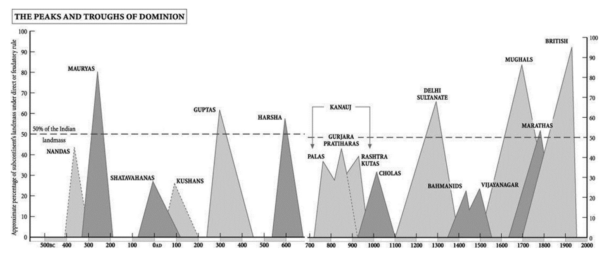

+++
author = "Brunnhilde"
title = "Indika - Una descolonizacion intelectual"
date = "2022-09-01"
description = "Breve resumen"
categories = [
    "libros",
    "india",
]
tags = [
    "india",
    "resumenes",
    "libro",
    "agustin paniker"
]
image = "india.jpg"
+++

# Índika. Una descolonización intelectual.

- El Islam no fue asimilado por el Hinduism 

## Periodo Muslims?
- Es absurdo llamar “islámico” al período mogol como referirse a la llegada de los británicos como una “invasión cristiana”

- ### ta’rîkh
- Delhi Sultanate
- La primera gran formación islámica del Sur de Asia, el Sultanato de Delhi, se consolidó al mismo tiempo que las invasiones mongolas arrasaban Asia Central y Persia.
- A los ojos de estos refugiados, la India se convirtió en la dinamo del mundo islámico.
- El sultan de Delhi pasa a asumir funciones parecidas al Califa
- En la práctica, las políticas indoislámicas fueron mucho más pragmáticas y eclécticas de lo que la conservadora retórica panegírica aparenta.

### El saqueo de Somanâtha
- 1026 es la fecha que invariablemente se proclama a la hora de datar el inicio del período –o yugo– Muslims en el Sur de Asia.
- Para el editor e historiador nacionalista K.M. Munshi la entrada en escena de Mahmûd significó el fin de la India clásica: «empezaba la India Medieval»
- Como dice Thapar, al destruir a Manat los musulmanes centroasiáticos podían presentarse como aquellos que habían colmado los deseos del Profeta de forma mucho más eficiente que los propios árabes
-  En suma, existe una absoluta y continua discrepancia en deter- minar si la imagen era de Shiva o de una diosa, antropomórfica o anicónica… y una fantasía creciente acerca de la riqueza y pujanza del templo.
- (Fuentes de Sanscrito) En ningún lugar se menciona que las restauraciones se debieran a la actitud iconoclasta turco-afgana. Y lo que aún es más significativo: ni una sola fuente sánscrita menciona el ataque de Mahmûd. Quizá el pillaje de un templo no fuera un hecho tan extraordinario en la India noroccidental del siglo XI.
- El documento precisa que para supervisar la operación debería formarse un comité local.
- Si el raid de Mahmûd hubiera sido tan traumático como habitualmente se escucha, es imposible que hubiera sido olvidado doscientos años después.
- El repetido argumento de que 1026 marca el hecho fundacional en la hostilidad entre Muslims e Hindus sale bastante malparado al yuxtaponer las distintas voces
- Ocurre que cuando los europeos arribaron al Sur de Asia y comenzaron a escribir su historia, únicamente escucharon las crónicas indo-persas.

### Identidades
- Con la llegada del islam, Hindu pasó a significar esencialmente el “otro” respecto del Muslims
- «la tradición sánscrita nunca ha notado oficialmente la existencia del islam»
- Fue en el contexto colonial/modernista cuando las identidades actuales (nacionales, lingüísticas, religiosas) tomaron forma y, a posteriori, fueron proyectadas en el pasado.
- En tiempos antiguos, la confrontación no se dio entre vagas categorías como “Hindus” o “Muslims”, sino entre turco-afgano y rajput

### La construccion del "Comunalismo" en Benares
- Según la lectura colonialista de la historia, la única fuerza dialéctica de la política y la sociedad indias fue la religión.
- Comunalismo
- Quisiera relatarles ahora la construcción colonial de este “atávico” comunalismo surasiático, la lacra de esta sociedad, aquella que, iniciándose en la profanación de Somnath, acabaría por conducir a la creación del Estado de Pakistan (plus Bangladesh).
- se fragua un argumento esencial del colonialismo: que el gobierno europeo es justo y necesario, pues la endémica división de los nativos los incapacita para autogobernarse y, de no ser por la intervención del gobierno, el comunalismo llevaría a la guerra civil.
- Sintetizando: el Colonial State se alza en marcado contraste con el carácter primitivo, prepolítico y proto-histórico de la sociedad local.

### Epilogo del Capitulo 
- Al dividir a los subditos en comunidades religiosas definidas y demarcadas los europeos acabaron por  «traducir esquemas de pensamiento subjetivos en realidades políticas objetivas»
- Divide and conquer
- Se terminan creyendo el discurso inventado para dividir

## Particion

### La Senda que Conduce a Pakistan
- Iniciaron Movimientos Comunalismo - 1880s 
- Fue entonces cuando un surasiático pudo ser percibido antes como Muslims, Hindu o Sikh que como indio
- El gobierno optó por jugar la carta Muslimspara frenar al Hindu Nationalism
- En cierta manera, las autoridades crearon primero las etiquetas en las que luego fueron encajados los súbditos
- Está claro que el discurso colonial vino a legitimar enemistades y estereotipos ya existentes en la India
- Nunca existió un tiempo en que la religión no estuviera ligada al poder
- Sir Herbert Risley
- Particion de Bengala
- Muslim League
- Morley-Minto Law acabó por otorgar electorados separados a los musulmanes
- Como resultado, nacieron las lógicas demandas de un Estado musulmán (el futuro Pakistan)
- El Comunalismo, el etnicismo o el nacionalismo son consecuencia del Modern State

### La teoria de las dos Naciones
- Quit India
- WWII
- El gran beneficiario de estos roces continuos con el nacionalismo anticolonial fue la Muslim League
- Jinnah, resurgió con la famosa “Two-nation theory”:
- Ni siquiera en el Punjab, el corazón de cualquier proyecto nacional para los musulmanes surasiáticos, se veía ninguna ventaja a un Pakistan autónomo. Los punjabis Muslims ya tenían el control de su territorio.
- La propuesta de un estado independiente vino de las elites modernistas y anglizadas
- 1940s
- Se promovio la idea del Partido del Congreso como aparato Hindu
- La Muslim League quería paridad con los hindúes, lo que significaba mantener electorados separados, cierta cuota en los cargos de gobierno y la demarcación de unas provincias de mayoría musulmana. El plan apenas implicaba reorganización demográfica.
- Una vez los musulmanes tuvieran su Pakistan y los hindúes su Hindustan podrían coordinarse políticas en asuntos extranjeros, comunicaciones, derechos civiles, defensa, etcétera.
- Pakistan representaba «un Estado-nación para los pueblos musulmanes de la India… y, al mismo tiempo… Pakistán trascendía las estructuras ordinarias del Estado; como tal, evocaba el ideal de un orden político Islamic»

### La Particion 
- 1946 
- El Congreso (que siempre se vio a sí mismo como el legítimo sucesor del British Raj) pensaba que un Estado con semejante grado de autonomía para las provincias degeneraría en intereses comunales.
- Violencia en Bengala
- En el Punjab la violencia incontrolada de marzo de 1947 coincidió con las campañas de desobediencia civil lanzadas por la Muslim League. Allí con los Sikh como terceros en discordia. Fue entonces cuando las áreas de mayoría musulmana, atizadas por las diatribas de la Liga, se sumaron abiertamente a la idea de Pakistan.
- En junio de 1947 Attlee y Mountbatten anunciaron que la India sería amputada y que el poder sería transferido a dos Estados separados.
- La independencia de la India y de Pakistán tuvo lugar el 15 de agosto de 1947
- Gyanendra Pandey afirma que para millones de surasiáticos la Independence y la Partition «fueron lo mismo»
- El huracán no amainó hasta el asesinato de Gandhi, en enero de 1948
- Después de meses de violencia sin control, el ayuno y subsiguiente martirio de Gandhi actuaron de forma casi milagrosa.
- Desde la vivisección del continente, no sólo los dos Estados han permanecido enfrentados, sino que sus minorías son blanco perpetuo de la ira de las mayorías.

### Why?
- El carácter marcial de los pueblos del Punjab es de sobras conocido. Se trata de una sociedad muy militarizada, corazón de los ejércitos surasiáticos.
- Sospechosamente, las versiones Nationalist comparten bastantes de los trazos de la lectura colonial.
-  La interpretación del Indian Nationalism trata de preservar la pureza e inocencia del pueblo, o bien minimizando el evento (un mero lapsus en la extraordinaria herencia de tolerancia, iluminación y liderazgo que caracteriza a la civilización hindú) o deslizándolo a una cadena conspiratoria de criminales y políticos sin escrúpulos
- Yo no tengo la menor duda de que el nacionalismo surasiático acabó por legitimar el discurso colonialista al responder a los nuevos retos de una manera asombrosamente coherente con el paradigma Orientalist.